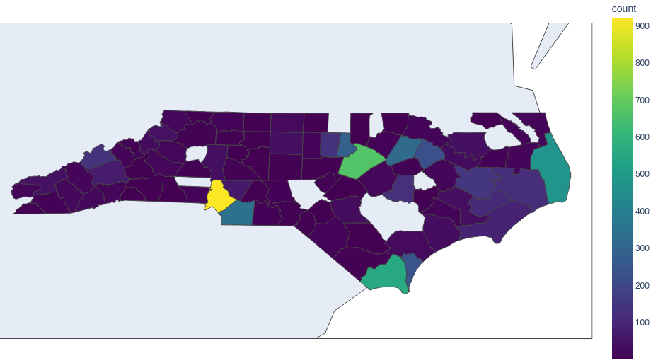

# flood-risk-ml-tutorial

To cite this tutorial use:  

The results of this tutorial are also published in [Enhancing Flood Risk Assessment Through Machine Learning and Open Data](https://doi.org/10.31223/X5XW95)

A machine learning tutorial demonstrating building classification for flood risk assessment

Urban flooding causes billions of dollars in damages annually, with severe flood events becoming more frequent and destructive as our climate changes. While extreme weather is a primary driver of flooding, its consequences depend on the interconnectedness of urban systems - referred to as the Urban Multiplex, which includes the power grid, transportation network, natural surface water and groundwater systems, sewerage and drinking water systems, intertwined with the socioeconomic and public health sectors.

This tutorial introduces machine learning concepts through an application in one component of the Urban Multiplex - building classification. Accurate and standardized information about buildings (e.g. classification into residential, commercial, industrial) is critical for assessing the number of people affected by flooding, the propagation of shocks throughout the economy, and for forecasting detailed socioeconomic risk from flooding. Yet, a major discrepancy exists in the way data about buildings are collected across the U.S. There is no harmonization in what data are recorded by city, county, or state governments, let alone at the national scale.

In this tutorial we explore multiple means of classifying a building (residential/classification/industrial/etc.) based on its features (location, square footage, proximity to other resources, etc.). Moreover, we are interested in how accurate or machine learning models can be using only free and open data. The data used in this tutorial is consistently and openly available for the continental Unites States. We use the state of North Carolina as an expemplar in this tutorial.

  

### Raw Data and Preprocessing
The tutorial notebook Building_Classification.ipynb utilizes a machine learning ready dataset provided in this GitHub repo. The raw data used to create the machine learning ready dataset are too large to include here. Raw data are available here:  and our preprocessing scripts can be found in the "preprocessing" folder.
